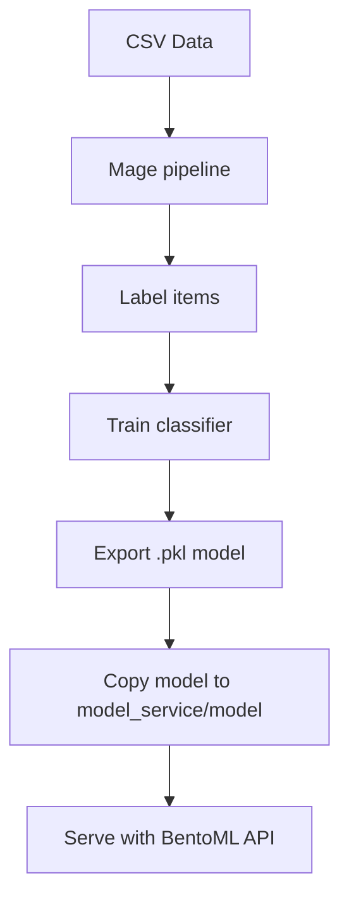

# 🧠 Clothing Classifier Monorepo

This project builds a simple ML pipeline to classify clothing products (e.g. `upper_body`, `lower_body`, `footwear`) using their identifiers or categories. It is structured into:

- [`mage/`](./mage): a Mage.ai workspace for labeling and training
- [`model_service/`](./model_service): a BentoML-powered API that serves the trained model

---

## 🗂️ Project Structure

```

clothing-classifier-monorepo/
├── mage/                   # Mage pipeline for cleaning, labeling, training
│   └── compose.yaml        # Starts Mage web UI on port 6789
├── model\_service/          # Dockerized BentoML API
│   ├── model/              # Expected location of clothing\_classifier.pkl
│   ├── service.py          # BentoML service definition
│   ├── Dockerfile
│   ├── compose.yaml        # Runs API on port 6788
│   └── test.sh             # Local test script (curl-based)
└── init.sh                 # Bootstraps project structure

````

---

## 🚀 Usage

### 1. 🔬 Launch Mage (for data exploration, labeling, training)

```bash
docker compose -f mage/compose.yaml up
````

* Access it at: [http://localhost:6789](http://localhost:6789)
* Load your CSV in a **data loader block**
* Use transformer blocks to normalize columns, auto-label, and train the model
* In the final training block, export the model like this:

```python
joblib.dump(pipeline, '/home/src/model_output/clothing_classifier.pkl')
```

✅ This will appear in: `mage/model_output/clothing_classifier.pkl`

---

### 2. 📁 Copy Trained Model to `model_service/`

⚠️ Currently, **both Mage and the API mount the same `model/` folder**, which causes volume conflicts in Docker. So, after training, manually copy the model file like this:

```bash
cp mage/model_output/clothing_classifier.pkl model_service/model/
```

You can script this if needed.

---

### 3. 🌐 Launch Model API

```bash
docker compose -f model_service/compose.yaml up --build
```

* API runs at: [http://localhost:6788](http://localhost:6788)
* Endpoints:

| Route            | Method | Description                   |
| ---------------- | ------ | ----------------------------- |
| `/predict`       | POST   | Single text classification    |
| `/batch_predict` | POST   | Batch classification of texts |

---

### 4. 🧪 Run Test Script

```bash
./model_service/test.sh
```

This sends sample requests to both endpoints and prints payload + response.

---

## 🔁 Development Flow Summary



---

## 🧼 Future Improvements

* Split volumes between dev and prod environments
* Auto-labeling improvements
* CI/CD for retraining + deploying new models
* Add Swagger/OpenAPI auto docs to API

---

## 📬 Credits

* 🔧 Mage.ai for data workflows
* ⚙️ BentoML for model serving

